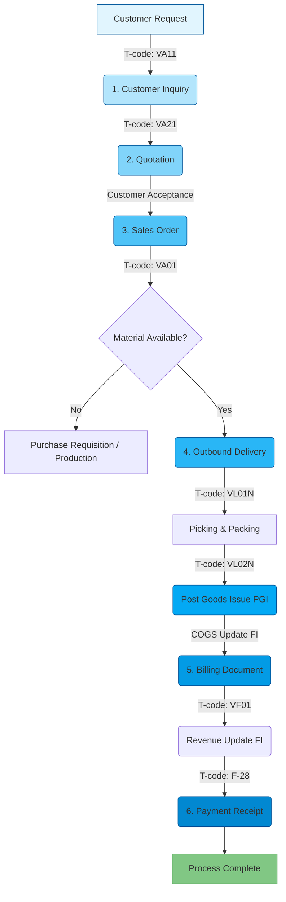

# O2C Process Flow Diagram

```mermaid
graph TD
    A[Customer Request] -->|T-code: VA11| B(1. Customer Inquiry)
    B -->|T-code: VA21| C(2. Quotation)
    C -->|Customer Acceptance| D(3. Sales Order)
    D -->|T-code: VA01| E{Material Available?}
    E -->|No| F[Purchase Requisition / Production]
    E -->|Yes| G(4. Outbound Delivery)
    G -->|T-code: VL01N| H[Picking & Packing]
    H -->|T-code: VL02N| I(Post Goods Issue PGI)
    I -->|COGS Update FI| J(5. Billing Document)
    J -->|T-code: VF01| K(Revenue Update FI)
    K -->|T-code: F-28| L(6. Payment Receipt)
    L --> M[Process Complete]

    style A fill:#e1f5fe,stroke:#01579b
    style B fill:#b3e5fc,stroke:#01579b
    style C fill:#81d4fa,stroke:#01579b
    style D fill:#4fc3f7,stroke:#01579b
    style G fill:#29b6f6,stroke:#01579b
    style I fill:#03a9f4,stroke:#01579b
    style J fill:#039be5,stroke:#01579b
    style L fill:#0288d1,stroke:#01579b
    style M fill:#81c784,stroke:#388e3c
```
